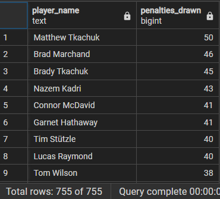
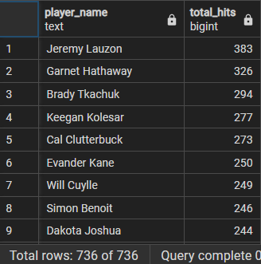
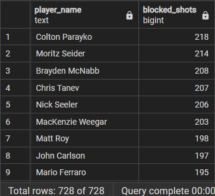
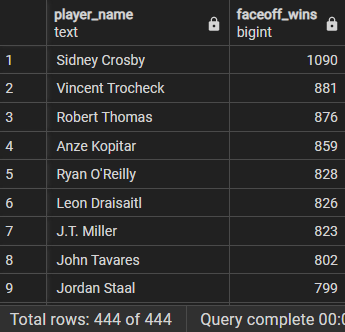
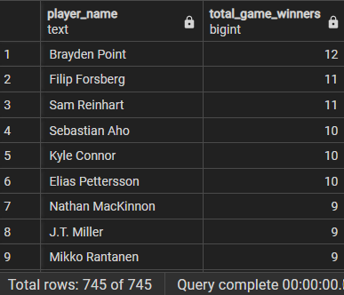
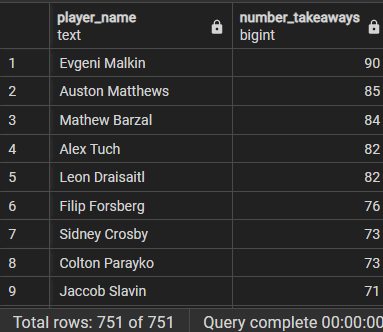
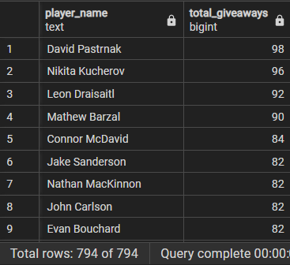
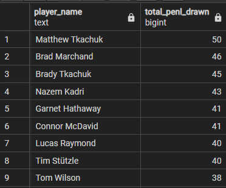
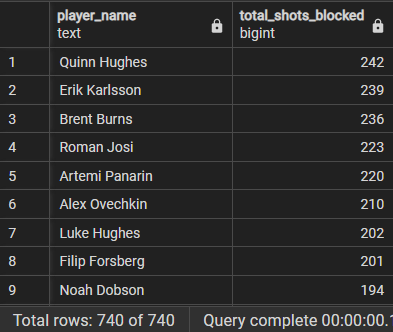

## League Leaders 
All answers are for the 2023-2024 regular season

**1. Who lead the league in save percentage?**
<!-- 
```SQL
SELECT r.first_name ||' '|| r.last_name AS player_name
	,SUM(g.shots_against)/(SUM(g.shots_against)+SUM(g.goals_against))  AS save_percentage --this line not working, work with CAST function
FROM goalie_game_data g
LEFT JOIN roster r ON g.player_id = r.player_id
GROUP BY player_name
ORDER BY save_percentage DESC;
```
-->


**2. Who lead the league in short-handed goals? How many?**
```SQL
SELECT r.first_name ||' '|| r.last_name AS player_name
	,SUM(s.sh_goals) AS short_handed_goals
FROM skater_game_data s
LEFT JOIN roster r ON s.player_id = r.player_id
GROUP BY player_name
ORDER BY short_handed_goals DESC;
```

Travis Konecny lead the league with 6 short-handed goals 

**Results**


**3. Who lead the league in penalties drawn? How many?**
```SQL
SELECT r.first_name ||' '|| r.last_name AS player_name
	,COUNT(r.player_id) AS penalties_drawn
FROM penalties p 
LEFT JOIN roster r ON p.drawn_by_player_id = r.player_id
GROUP BY player_name
ORDER BY penalties_drawn DESC;;
```

Matthew Tkachuk lead the league in penalties drawn, with 50. 

**Results**




**4. Who lead the league in hits? How many?**
```SQL
SELECT r.first_name ||' '|| r.last_name AS player_name
	,COUNT(r.player_id) AS total_hits
FROM hits h
LEFT JOIN roster r ON h.hitter_id = r.player_id
GROUP BY player_name
ORDER BY total_hits DESC;
```

Jeremy Lauzon lead the league in hits with 383. 

**Results**




**5. Who lead the league in blocked shots? How many?**
```SQL
SELECT r.first_name ||' '|| r.last_name AS player_name
	,COUNT(r.player_id) AS blocked_shots
FROM shots s 
LEFT JOIN roster r ON s.block_player_id = r.player_id
WHERE s.event_name LIKE 'blocked_shot' 
GROUP BY player_name
ORDER BY blocked_shots DESC;
```

Colton Parayko leads the league in blocked shots with 218.

**Results**




**6. Who lead the league in faceoff wins? How many?**
```SQL
SELECT r.first_name ||' '|| r.last_name AS player_name
	,COUNT(r.player_id) AS faceoff_wins
FROM faceoffs f 
LEFT JOIN roster r ON f.w_player_id = r.player_id
GROUP BY player_name
ORDER BY faceoff_wins DESC;
```

Sidney Crosby lead the league in faceoff wins with 1090. 

**Results**




**7. Who had the most game winning goals? How many?**
```SQL
SELECT r.first_name ||' '|| r.last_name AS player_name
	,SUM(s.game_winning_goals) AS total_game_winners
FROM skater_game_data s
LEFT JOIN roster r ON s.player_id=r.player_id
GROUP BY player_name
ORDER BY total_game_winners DESC;
```

Brayden Point lead the league in game winning goals with 12. 

**Results**



**8. Who lead the league with average time on ice?**


**9. Who lead the league in shooting percentage?**


**10. Who lead the league in takeaways? How many?**
```SQL
SELECT r.first_name ||' '|| r.last_name AS player_name
	,COUNT(r.player_id) AS number_takeaways
FROM takeaways t 
LEFT JOIN roster r ON t.take_player_id = r.player_id
GROUP BY player_name 
ORDER BY number_takeaways DESC;
```

Evgeni Malkin lead the league in takeaways with 90. 

**Results**




**11. Who had the most giveaways? How many?**

```SQL
SELECT r.first_name ||' '|| r.last_name AS player_name
	,COUNT(r.player_id) AS total_giveaways
FROM giveaways g
LEFT JOIN roster r ON g.give_player_id = r.player_id
GROUP BY player_name
ORDER BY total_giveaways DESC;
```

David Patrnak lead the league in giveaways with 98. 

**Results**




**12. Who drew the most penalties? How many?**
```SQL 
SELECT r.first_name ||' '|| r.last_name AS player_name
	,COUNT(p.drawn_by_player_id) AS total_penl_drawn
FROM penalties p 
RIGHT JOIN roster r ON p.drawn_by_player_id = r.player_id
GROUP BY player_name
ORDER BY total_penl_drawn DESC;
```

Matthew Tkachuk drew the most penalties with 50. 


**Results**




**13. Who had the most shots blocked? How many?**

```SQL
SELECT r.first_name ||' '|| r.last_name AS player_name
	,COUNT(r.player_id) AS total_shots_blocked
FROM shots s 
LEFT JOIN roster r ON s.shoot_player_id = r.player_id
WHERE s.event_name LIKE 'blocked-shot'
GROUP BY player_name
ORDER BY total_shots_blocked DESC;
```

Quinn Hughes had 242 of his shots blocked. 

**Results**

