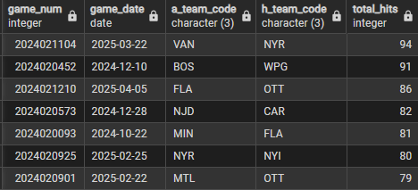
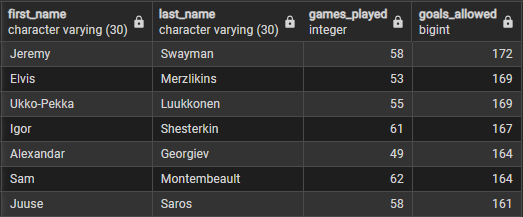
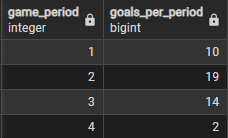
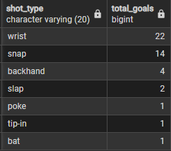
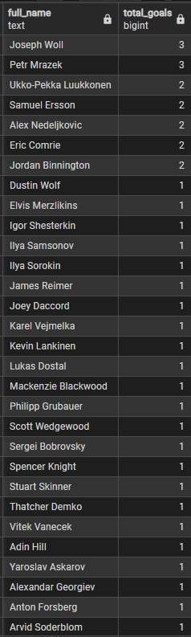
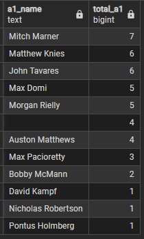
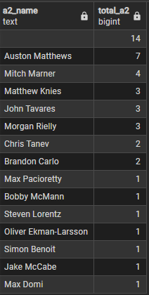

**1. Total Hits by Game**
Total hits by game, sorted in descending order 

```SQL 
SELECT game_num
	,game_date
	,a_team_code
	,h_team_code
	,(a_hits + h_hits) AS total_hits
FROM game_story
ORDER BY total_hits DESC;
```




**2. Player Id's**
Pulling the player id's for the league's top 5 goal scorers. 

```SQL 
SELECT player_id
	,first_name
	,last_name
FROM player_info
WHERE last_name IN ('Draisaitl', 'Nylander', 'Ovechkin', 'Thompson', 'Pastrnak');
```

**3.Pulling goal info**
Pulling the goal info required for graphing goal locations of the league's top 5 scorers

```SQl
SELECT g.game_id
	  ,gs.h_team_id
	  ,gs.a_team_id
	  ,g.game_period
	  ,g.time_remaining
	  ,g.home_def_code
	  ,g.event_owner_team_id
	  ,g.x_coord
	  ,g.y_coord
	  ,g.shot_type
	  ,g.score_player_id
FROM goals g
LEFT JOIN game_story gs ON g.game_id = gs.game_num
WHERE g.score_player_id IN (8477934, 8477939, 8471214, 8479420, 8477956);
```

**4. Most goals allowed**
```SQL 
SELECT p.first_name
	,p.last_name
	,gr.games_played
	,COUNT(g.goalie_in_id) AS goals_allowed
FROM goals g
LEFT JOIN player_info p ON g.goalie_in_id = p.player_id
LEFT JOIN goalie_reg_stats gr ON g.goalie_in_id = gr.player_id
GROUP BY goalie_in_id
		,p.last_name
		,p.first_name
		,games_played
ORDER BY goals_allowed DESC;
```



**5.William Nylander's goals**

Query to pull all of William Nylander's goals
```SQL
SELECT game_id
	,game_period
	,time_remaining
	,situation_code
	,home_def_code
	,event_owner_team_id
	,zone_code
	,x_coord
	,y_coord
	,shot_type
	,assist_1_player_id
	,assist_2_player_id
	,goalie_in_id
FROM goals
WHERE score_player_id = 8477939 AND game_period <> 5;
```

number of goals scored by period
```SQL
SELECT game_period
	,COUNT(game_period) AS goals_per_period
FROM goals
WHERE score_player_id = 8477939 AND game_period <> 5
GROUP BY game_period
ORDER BY game_period;
```



Number of goals scored by shot type
```SQL
SELECT shot_type
	,COUNT(shot_type) AS total_goals
FROM goals
WHERE score_player_id = 8477939 AND game_period <> 5
GROUP BY shot_type
ORDER BY total_goals DESC;
```




Number of goals scored on specific goalies 
```SQL
SELECT CONCAT(p.first_name, ' ', p.last_name) AS full_name
	,COUNT(g.goalie_in_id) AS total_goals
FROM goals g
LEFT JOIN player_info p ON g.goalie_in_id = p.player_id
WHERE g.score_player_id = 8477939 
	AND g.game_period <> 5
	AND g.goalie_in_id IS NOT NULL
GROUP BY full_name
ORDER BY total_goals DESC;
```



Query shows Nylander scored 3 goals on Joseph Woll - this isn't possible so that information is incorrect in the data. Under further investigation these goals were scored in games 2024020807 and 2024021216. 1 goal was scored on Filip Gustavsson and the other 2 were scored on Elvis Merzlikins.


Who has the greatest number of primary assists on Nylander goals?
```SQL
SELECT CONCAT(p.first_name, ' ', p.last_name) AS a1_name
	,COUNT(COALESCE(g.assist_1_player_id, 0)) AS total_a1
FROM goals g
LEFT JOIN player_info p ON g.assist_1_player_id = p.player_id
WHERE score_player_id = 8477939
	AND game_period <> 5
GROUP BY a1_name
ORDER BY total_a1 DESC;
```




Who has the greatest number of secondary assists on Nylander goals?
```SQL
SELECT CONCAT(p.first_name, ' ', p.last_name) AS a2_name
	,COUNT(COALESCE(g.assist_2_player_id, 0)) AS total_a2
FROM goals g
LEFT JOIN player_info p ON g.assist_2_player_id = p.player_id
WHERE score_player_id = 8477939
	AND game_period <> 5
GROUP BY a2_name
ORDER BY total_a2 DESC;
```



