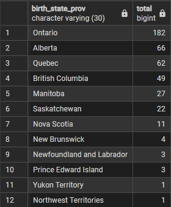
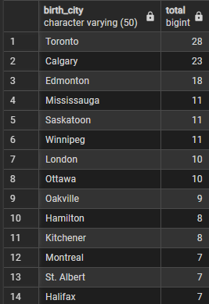
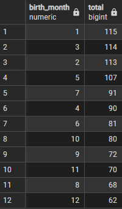

## Random Queries

**Most Popular Names in the NHL**
```SQL
SELECT first_name
	,COUNT(first_name) as Total
FROM player_info
GROUP BY first_name
ORDER BY Total DESC;
```

\* does not account for different variations or spellings of names (Alex and Alexander for example show up as different names)


**Where NHL players were Born**
```SQL
SELECT birth_country
	,COUNT(birth_country) AS total
FROM player_info
GROUP BY birth_country
ORDER BY total DESC;
```

\* This is the country where the player was born, not necessarily their nationality/country they represesnt on the international stage


**Most common birth Province**
```SQL 
SELECT birth_state_prov
	,COUNT(birth_state_prov) AS total 
FROM player_info 
WHERE birth_country = 'CAN'
GROUP BY birth_state_prov
ORDER BY total DESC;
```



**Most Common Canadian birth city**
```SQL
SELECT birth_city
	,COUNT(birth_city) AS total 
FROM player_info 
WHERE birth_country = 'CAN'
GROUP BY birth_city
ORDER BY total DESC;
```




**Most common birth month**
```SQL
SELECT EXTRACT(MONTH FROM birth_date) AS birth_month
	,COUNT(EXTRACT(YEAR FROM birth_date)) AS total
FROM player_info
GROUP BY birth_month
ORDER BY total DESC;
```



