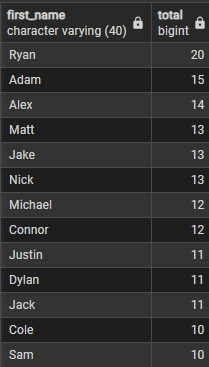
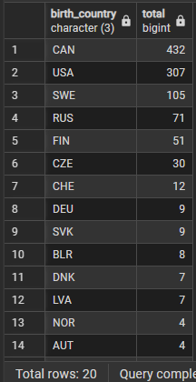

## Random Queries

**Most Popular Names in the NHL**
```SQL
SELECT first_name
	,COUNT(first_name) as Total
FROM player_info
GROUP BY first_name
ORDER BY Total DESC;
```

\* does not account for different variations or spellings of names (Alex and Alexander for example show up as different names)





**Where NHL players were Born**
```SQL
SELECT birth_country
	,COUNT(birth_country) AS total
FROM player_info
GROUP BY birth_country
ORDER BY total DESC;
```

\* This is the country where the player was born, not necessarily their nationality/country they represesnt on the international stage





**Most common birth Province**
```SQL 


```