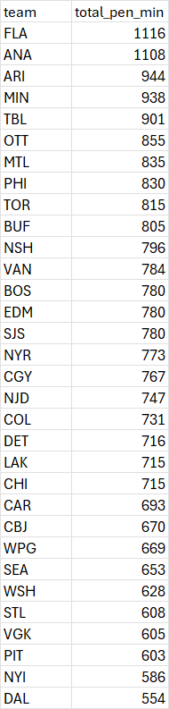
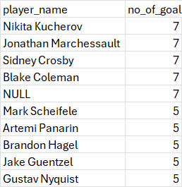
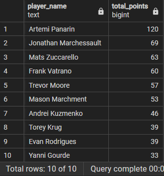

**1. Total Season Penalty Minutes by Team**

total penalty minutes taken by each team in the season. Listed most to least penalties. 

```SQL
SELECT te.team
	  ,sum(pe.penl_len) AS total_pen_min
FROM penalties pe
LEFT JOIN teams te ON pe.event_owner_team_id = te.team_id
GROUP BY te.team
ORDER BY total_pen_min DESC;
```

**Results**





**2. Empty Net Goals on the Season**
total number of empty net goals scored by player

```SQL 
SELECT r.first_name || ' ' || r.last_name AS player_name
	,COUNT(g.score_player_id) AS no_of_goals
FROM goals g 
LEFT JOIN roster r ON g.score_player_id = r.player_id
WHERE goalie_in_id IS NULL 
GROUP BY player_name
ORDER BY no_of_goals DESC
;
```

**Results**




**3. Undrafted players that lead the league in points - top 10**
```SQL
SELECT d.first_name ||' '|| d.last_name AS player_name
	,SUM(s.points) AS total_points
FROM draft d 
RIGHT JOIN skater_game_data s ON d.player_id = s.player_id
WHERE d.draft_team IS NULL 
GROUP BY player_name
ORDER BY total_points DESC
LIMIT 10;
```

**Results**

