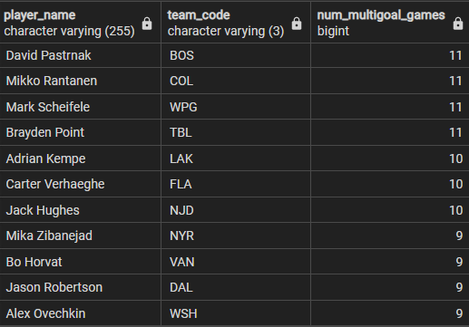

**Players with the most blocks per game**
```SQL
SELECT player_name
	  ,team_code AS team
	  ,game_date
	  ,game_num
	  ,player_position
	  ,blocks
FROM players 
ORDER BY blocks DESC
LIMIT 20
```

The limit 20 gets all the players with 8 blocks per game

**Results**


**Players with the most total blocks on the season (top 10)**
```SQL
SELECT player_name
	  ,team_code
	  ,sum(blocks) AS total_blocks
FROM players 
GROUP BY player_name, team_code
ORDER BY total_blocks DESC
LIMIT 10
```

**Results**


**Players with the most multi-goal games (top 10)**

```SQL 
SELECT player_name
	  ,team_code
	  ,COUNT(player_name) AS num_multigoal_games
FROM players 
WHERE goals > 1
GROUP BY player_name
		 ,team_code
ORDER BY num_multigoal_games DESC
LIMIT 12;
```

included limit 12 to get all players with 9 multi-goal games

**Results**




